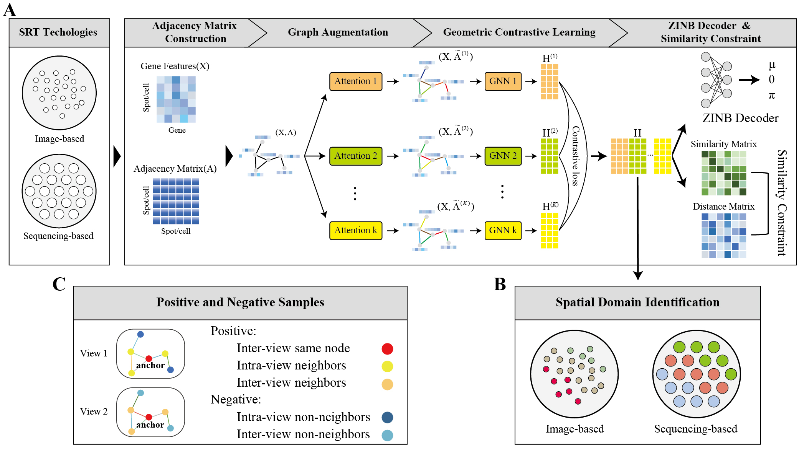

This repository contains the code for the paper "Relation-aware graph augmentation with geometric contrastive learning improves the domains identification from spatially resolved transcriptomics data."

## Introduction

SpaGRA is designed to capture the latent representations of spots or cells using graph augmentation and geometric contrastive learning. It effectively integrates gene expression and spatial location information from SRT data.

For graph augmentation, SpaGRA employs spatial distance as prior knowledge and updates graph relationships using multi-head GATs. Following this, geometric contrastive learning is used to enhance the discriminability of the latent embeddings. SpaGRA also leverages these multi-view relationships to construct more rational negative samples, significantly increasing its discriminability. The model is trained using contrastive loss, similarity constraint loss, and ZINB loss. Ultimately, SpaGRA applies the learned embeddings to cluster spatial domains.

The workflow of SpaGRA is shown in the following diagram.



## Installation  
SpaGRA is implemented using Python 3.7.12 and Pytorch 1.11.0.    

Users can install SpaGRA through PyPI.  

### Install from PyPI  
`pip install SpaGRA`

### Requirements
numpy==1.21.5  
torch==1.11.0  
pandas==1.3.5  
numba==0.55.1  
scanpy==1.9.1  
scikit-learn==1.0.2  
scipy==1.7.3  
anndata==0.8.0  
matplotlib==3.5.2  

## Datasets
All datasets used in this paper are publicly available. Users can download them from the links below.

Some processed datasets are also available at SODB (https://gene.ai.tencent.com/SpatialOmics/) and can be loaded by PySODB (https://protocols-pysodb.readthedocs.io/en/latest/).  
    
### Human breast cancer  
https://support.10xgenomics.com/spatial-gene-expression/datasets/1.1.0/V1_Breast_Cancer_Block_A_Section_1  

### Mouse hypothalamus  
https://datadryad.org/stash/dataset/doi:10.5061/dryad.8t8s248  

### Mouse primary visual area  
https://spacetx.github.io/data.html  

### Mouse embryo  
https://db.cngb.org/stomics/mosta/  

### Visium HD  
https://www.10xgenomics.com/datasets/visium-hd-cytassist-gene-expression-libraries-of-mouse-intestine  
https://www.10xgenomics.com/datasets/visium-hd-cytassist-gene-expression-libraries-of-human-crc    

### Annotations  
Except for the Visium HD data, all domain annotations have been manually annotated in previously published papers, which can be downloaded from the above websites.

## Tutorial

We provided some demos in paper to demonstrate usage of SpaGRA.    

### Human breast cancer  
First, load the required packages and data.
```python
# Importing necessary libraries
import os,csv,re
import pandas as pd
import numpy as np
import scanpy as sc
import matplotlib.pyplot as plt
from sklearn.metrics.cluster import adjusted_rand_score
import warnings
warnings.filterwarnings('ignore')
from SpaGRA.utils import *
from SpaGRA.process import *
from SpaGRA import train_model
from sklearn.metrics import normalized_mutual_info_score

# Loading spatial transcriptomics data using Scanpy
adata = sc.read_visium("Data/V1_Breast_Cancer_Block_A_Section_1",
                count_file="V1_Breast_Cancer_Block_A_Section_1_filtered_feature_bc_matrix.h5")
```
Next, the raw data is preprocessed.  
This includes (1) Ensuring that gene names are unique. （2）Filtering out genes that are minimally expressed in different cells. (3) Identifying and retaining genes that are highly variable. （4）Data normalization and log transformation. （5）Adjacency matrix calculation.
```
adata.var_names_make_unique()  
prefilter_genes(adata, min_cells=3)  
sc.pp.highly_variable_genes(adata, flavor="seurat_v3", n_top_genes=1000) 
sc.pp.normalize_per_cell(adata) 
sc.pp.log1p(adata)
Ann_df = pd.read_csv("Data/V1_Breast_Cancer_Block_A_Section_1/metadata.tsv", sep="	", header=0, na_filter=False,
                     index_col=0)
adata.obs['Ground Truth'] = Ann_df.loc[adata.obs_names, 'fine_annot_type']
Cal_Spatial_Net(adata, rad_cutoff=400)  
```
Finally, the model is trained and the clustering results are saved.
```
adata = train_model.train(adata,k=20,n_epochs=200)
obs_df = adata.obs.dropna()

# Calculating Adjusted Rand Index (ARI)
ARI = adjusted_rand_score(obs_df['SpaNCL'], obs_df['Ground Truth'])
print('Adjusted rand index = %.2f' % ARI)

# Plotting UMAP visualization
sc.pp.neighbors(adata, use_rep='SpaGRA')
sc.tl.umap(adata)
plt.rcParams["figure.figsize"] = (3, 3)
sc.pl.umap(adata, color=["SpaGRA", 'Ground Truth'], title=['SpaGRA (ARI=%.2f)' % ARI, 'Ground Truth'],save="SpaGRA_umap")

# Display and save clustering results
plt.rcParams["figure.figsize"] = (3, 3)
sc.pl.spatial(adata, color=["SpaGRA", 'Ground Truth'], title=['SpaGRA (ARI=%.2f)' % ARI, 'Ground Truth'],save="SpaGRA")
```


### Visium HD    
First, load the required packages and data.
```python
# Importing necessary libraries
import os,csv,re
import pandas as pd
import numpy as np
import scanpy as sc
import matplotlib.pyplot as plt
from sklearn.metrics.cluster import adjusted_rand_score
import warnings
warnings.filterwarnings('ignore')
from SpaGRA.utils import *
from SpaGRA.process import *
from SpaGRA import train_model

# Loading spatial transcriptomics data using Scanpy
adata = sc.read("Data/HD/HD2.h5ad")
```
Next, the raw data is preprocessed.  
```
adata.var_names_make_unique()
prefilter_genes(adata, min_cells=3) 
sc.pp.highly_variable_genes(adata, flavor="seurat_v3", n_top_genes=1000)
sc.pp.normalize_per_cell(adata)
sc.pp.log1p(adata)
Cal_Spatial_Net(adata, rad_cutoff=150)
```
Finally, the model is trained and the clustering results are saved.  
```
adata = train_model.train(adata,hidden_dims=1000, n_epochs=200,num_hidden=600,lr=0.00008, key_added='SpaNCL',a=2,b=1,c=1,
                radius=0,  weight_decay=0.00001,  random_seed=0,feat_drop=0.02,attn_drop=0.01,
                negative_slope=0.02,heads=4,method = "louvain",reso=0.8)


# Display and save clustering results
coor = pd.DataFrame(adata.obsm['spatial'])
coor.index = adata.obs.index
coor.columns = ['imagerow', 'imagecol']
adata.obs["x_pixel"]=coor['imagerow']
adata.obs["y_pixel"]=coor['imagecol']

domains='SpaGRA'
title = 'SpaGRA'
ax = sc.pl.scatter(adata, alpha=1, x="x_pixel", y="y_pixel", color=domains, legend_fontsize=18, show=False,
                   size=100000 / adata.shape[0])
ax.set_title(title, fontsize=23)
ax.set_aspect('equal', 'box')
ax.set_xticks([])
ax.set_yticks([])
ax.axes.invert_yaxis()
plt.savefig("HD2.pdf")
plt.close()
```


## Citation

The paper is under review...
